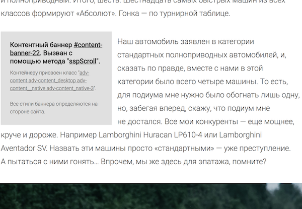

## Advert (adfox) content banners
Скрипт для автоматической расстановки рекламных мест в контенте топика в зависимости от переданной конфигурации.

В комплекте идут все необходимые зависимости и полифилы.

### Установка через пакетный менеджер
```bash
npm i rds-content-banners --save
```

Или через yarn:
```bash
yarn add rds-content-banners
```

### Демонстрация функционала
В пакет включена демо страница с сайта motor.ru ["Копья судьбы"](https://motor.ru/reports/unlim500.htm#development=1) (из страницы убран весь не относящийся к делу контент и функционал).

Вот как выглядит одно из баннерных мест в этом примере.
<br/><br/><br/>

[Посмотрите пример работы скрипта на github pages](https://rambler-digital-solutions.github.io/rds-content-banners/example/index.html#development=1). Чтобы открыть этот пример локально, после установки пакета, запустите команду из корневой дерктории проекта:
```bash
open ./node_modules/rds-content-banners/example/index.html
```

Или просто откройте файл example/index.html вручную.

### Пример использования на lenta.ru
```javascript
// есть два варианта подключения:
//  1. как npm пакет: var contentBanners = require('advert-content-banners');
//  2. как commonjs модуль из проекта: var contentBanners = require('path/to/advert-content-banners-index');
var contentBanners = require('advert-content-banners');


// определяем коллекциию настроек для баннеров
var settings = {
  // селектор dom элемента в котором находится контент топика
  // подробнее смотрите в разделе "Более детально про конфигурацию"
  root: '.b-topic__content > .js-topic__text',

  // селекторы блоков, которые являются контен
  // и которые считаются за элементы контента (все кроме мусора)
  // на lenta.ru это боксы, параграфы и заголовки
  // подробнее смотрите в разделе "Более детально про конфигурацию"
  nodes: ['.b-box', '.b-box_floated', 'p', 'h1', 'h2', 'h3', 'h4', 'h5', 'h6'],

  // селекторы блоков в контенте, которые являются плавающими
  // подробнее смотрите в разделе "Более детально про конфигурацию"
  floats: ['.b-box_floated'],

  // циклический вывод баннеров из массива places (по умолчанию false)
  looped: false,

  // коллекция рекламных мест
  places: [
    {
      // Смещение в текстовых символах (символах, которые находятся внутри p)
      //  от предыдущего рекламного места (или от начала контейнера).
      // Указывается в соответсвии с требованиями к каждому рекламному месту.
      offset: 1500,

      // Количество текстовых символов, которое обязатеьно должно быть доступно после текущего рекламного места.
      // Сделано для того, чтобы для вставки плавающих баннеров (float) было достаточно место.
      haveToBeAtLeast: 500,

      // Метод инициализации баннера.
      // От названия метода зависит как будет вызван window.Adf.banners[method].
      //  - По умолчанию: window.Adf.banners[method](id, bannerOptions, className);
      //  - Для бегуна: window.Adf.banners[method](id, bannerOptions, begunOptions, className);
      method: 'sspScroll',

      // Класс, который передается в window.Adf.banners[method].
      className: '.banner',

      // Если рядом с рекламным баннером должен быть пустой div с конкретным id,
      // то это можно сделать через это свойство. Актуально для in_read баннеров.
      siblingId: 'in_read',

      // Опции баннера, которые передаются в window.Adf.banners[method].
      bannerOptions: {
        p1: 'bujkh',
        p2: 'ewzc',
        puid49: 2,
        pct: 'a'
      },

      // Вызывать баннер повторно, пока не закончится статья. (В основных настройках необходимо устрановить looped: true)
      looped: fasle,

      // Опции бегуна, которые передаются в window.Adf.banners[method].
      begunOptions: {
        'begun-block-id': 432172892,
        'begun-auto-pad': 432172862
      }
    },

    // ...
  ]
};

contentBanners();
```

### Более детально про конфигурацию
#### settings.root
Селектор для контейнера, в котором находятся все блоки контента (параграфы, картинки и так далее).

#### settings.nodes
Это все врезы, в которых может быть контент: параграфы, галереи, картинки и так далее которые не обтекаются текстом (обычно занимают 100% ширины контента).
Причем, все блоки должны быть на одном уровне вложенности.
Примеры можно посмотреть в [топике на lenta.ru](https://lenta.ru/articles/2017/05/03/kingarthurplaces/), где контент состоит из параграфов и врезов типа "Галерея":
<br/><br/><br/>

#### settings.floats
Это так называемые "Плавающие врезы" (у которых float: left || right).
Их необходимо также учитывать для того, чтобы рекламные места не вставлялись около них.
Пример "Плавающего" вреза в [топике на lenta.ru](https://lenta.ru/news/2017/05/03/iphone/):
<br/><br/><br/>

#### settings.looped
Если статья большая, а баннеры в массиве places уже закончились, баннерные коды будут выведены повторно, если у кода установленно значение looped: true.

### Пример конфигурации рекламных мест
Изначально, речь шла о следующей конфигурации рекламных мест:
```javascript
var places = [
  { // adcenter
    offset: 1500,
    haveToBeAtLeast: 500,
    method: 'sspScroll',
    // ...
  },

  { // inread
    offset: 2000,
    haveToBeAtLeast: 500,
    method: 'sspScroll',
    // ...
  },

  { // native
    offset: 1000,
    haveToBeAtLeast: 1000,
    method: 'sspScroll',
    // ...
  },

  { // adcenter
    offset: 2000,
    haveToBeAtLeast: 500,
    method: 'sspScroll',
    // ...
  },

  { // native
    offset: 2000,
    haveToBeAtLeast: 1000,
    method: 'sspScroll',
    // ...
  }
];
```

### Как посмотреть какой баннер с какими настройками был вызван?
Добавьте в url `#development=1` и перезагрузите страницу. Все вызванные баннеры и их настройки будут залоггированы в консоль браузера.
